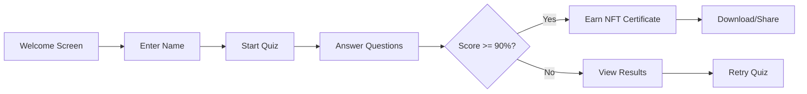

<div align="center">
  <h1>⚡ CeloIQ</h1>
  <p><strong>Test Your CELO Blockchain Knowledge & Earn NFT Certificates</strong></p>
  
  [](https://react.dev/)
  [](https://www.typescriptlang.org/)
  [](https://vitejs.dev/)
  [](https://celo.org/)
  [](LICENSE)

  <p>
    <a href="#-features">Features</a> •
    <a href="#-quick-start">Quick Start</a> •
    <a href="#-how-it-works">How It Works</a> •
    <a href="#-tech-stack">Tech Stack</a> •
    <a href="#-smart-contract">Smart Contract</a> •
    <a href="#-contributing">Contributing</a>
  </p>
</div>

---

## 🎯 Overview

**CeloIQ** is an interactive, gamified quiz platform designed to test and enhance knowledge about the CELO blockchain ecosystem. Built with modern web technologies and featuring stunning sci-fi aesthetics, CeloIQ offers users an engaging way to learn about CELO while earning downloadable NFT certificates for outstanding performance.

### 🌟 Why CeloIQ?

- **Educational**: Learn about CELO's unique features, consensus mechanisms, and ecosystem
- **Rewarding**: Earn beautiful NFT certificates for high scores (90%+)
- **Web3 Native**: Seamless wallet integration with automatic network switching
- **On-Chain Ready**: Smart contract integration for verifiable achievements
- **Mobile Friendly**: Fully responsive design with share capabilities

---

## ✨ Features

### 🧠 Interactive Quiz Experience
- **10 Curated Questions** covering CELO blockchain fundamentals
- **Real-time Feedback** with instant answer validation
- **Progress Tracking** with visual progress indicators
- **Navigation Controls** to review and change answers

### 🏆 NFT Certificate System
- **Downloadable Certificates** with unique IDs for top performers
- **Canvas-Generated Images** with CELO-themed designs
- **Share Functionality** for social media and messaging apps
- **Mobile Optimized** with native share support

### 🔗 Web3 Integration
- **MetaMask Support** with one-click wallet connection
- **Automatic Network Switching** to CELO Alfajores Testnet
- **Smart Contract Ready** for on-chain score submission
- **Address Display** with formatted wallet addresses

### 🎨 Premium UI/UX
- **Sci-Fi Aesthetic** with neon glows and futuristic design
- **Smooth Animations** powered by CSS transitions
- **Dark Theme** optimized for extended viewing
- **Responsive Layout** for all device sizes

---

## 🚀 Quick Start

### Prerequisites

Ensure you have the following installed:

- **Node.js** v20 or higher ([Download](https://nodejs.org/))
- **pnpm** (recommended) or npm
- **MetaMask** browser extension ([Install](https://metamask.io/))
- **Git** v2.38 or higher

### Installation

1. **Clone the repository**
   ```bash
   git clone https://github.com/cypherpulse/Celo-MiniPay-MiniApp-Demo.git
   cd celo-quiz-app
   ```

2. **Install dependencies**
   ```bash
   pnpm install
   # or
   npm install
   ```

3. **Start development server**
   ```bash
   pnpm dev
   # or
   npm run dev
   ```

4. **Open your browser**
   
   Navigate to `http://localhost:5173`

### Building for Production

```bash
# Build the application
pnpm build

# Preview production build
pnpm preview
```

The build output will be in the `dist/` directory.

---

## 📖 How It Works

### User Journey



### Step-by-Step

1. **Welcome & Introduction**
   - User enters their name
   - Views quiz features and requirements
   - Clicks "Begin Intelligence Test"

2. **Quiz Interface**
   - 10 questions about CELO blockchain
   - Multiple choice format (A, B, C, D)
   - Real-time answer validation
   - Navigation between questions

3. **Wallet Connection** (Optional but Recommended)
   - Click "Connect Wallet" button
   - Approve MetaMask connection
   - Automatic switch to CELO Alfajores Testnet
   - Network automatically added if not present

4. **Results & Rewards**
   - View final score and performance
   - Score 90%+ unlocks NFT certificate
   - Download certificate as PNG image
   - Share achievement on social media

5. **On-Chain Submission** (Coming Soon)
   - Submit score to smart contract
   - View leaderboard rankings
   - Permanent on-chain verification

---

## 🛠️ Tech Stack

### Frontend

| Technology | Version | Purpose |
|------------|---------|---------|
| [React](https://react.dev/) | 19.2.0 | UI library with hooks and modern patterns |
| [TypeScript](https://www.typescriptlang.org/) | 5.9.3 | Type-safe JavaScript |
| [Vite](https://vitejs.dev/) | 7.2.2 | Fast build tool and dev server |
| [CSS3](https://developer.mozilla.org/en-US/docs/Web/CSS) | Latest | Custom styling with animations |

### Web3 Libraries

| Library | Version | Purpose |
|---------|---------|---------|
| [@celo/contractkit](https://www.npmjs.com/package/@celo/contractkit) | 10.0.2 | CELO blockchain interaction |
| [ethers](https://docs.ethers.org/) | 5.7.2 | Ethereum wallet and contract interactions |
| [viem](https://viem.sh/) | 2.39.3 | Modern Web3 library |

### Development Tools

- **ESLint** - Code linting and quality
- **TypeScript ESLint** - TypeScript-specific linting rules
- **Vite Plugin React** - Fast refresh and optimizations

---

## 📜 Smart Contract

### CeloQuiz.sol

The quiz platform is backed by a Solidity smart contract deployed on CELO:

```solidity
contract CeloQuiz {
    struct QuizAttempt {
        address participant;
        uint8 score;
        uint256 timestamp;
    }
    
    mapping(address => QuizAttempt[]) public userAttempts;
    mapping(address => uint8) public bestScores;
    
    function submitQuiz(uint8 score) external;
    function getUserAttempts(address user) external view returns (QuizAttempt[] memory);
    function getLeaderboard(uint256 limit) external view returns (QuizAttempt[] memory);
}
```

### Key Features

- **Score Submission** - Submit quiz results on-chain
- **Attempt History** - Track all user attempts
- **Best Scores** - Automatically track highest scores
- **Leaderboard** - Global ranking system
- **Event Emission** - Quiz completion events for indexing

### Contract Deployment

```bash
# Coming soon - Deployment instructions
```

---

## 🌐 CELO Network Configuration

### Alfajores Testnet (Default)

```json
{
  "chainId": "0xaef3",
  "chainName": "Celo Alfajores Testnet",
  "nativeCurrency": {
    "name": "CELO",
    "symbol": "CELO",
    "decimals": 18
  },
  "rpcUrls": ["https://alfajores-forno.celo-testnet.org"],
  "blockExplorerUrls": ["https://alfajores-blockscout.celo-testnet.org/"]
}
```

**Get testnet tokens**: [CELO Faucet](https://faucet.celo.org)

### Mainnet

```json
{
  "chainId": "0xa4ec",
  "chainName": "Celo Mainnet",
  "rpcUrls": ["https://forno.celo.org"],
  "blockExplorerUrls": ["https://explorer.celo.org/"]
}
```

---

## 📚 Quiz Topics Covered

The CeloIQ quiz tests knowledge across multiple CELO domains:

| Category | Topics |
|----------|--------|
| **Platform Basics** | CELO overview, mission, and unique features |
| **Tokenomics** | CELO, cUSD, cEUR, cREAL stablecoins |
| **Consensus** | Proof of Stake mechanism and validators |
| **Performance** | Block time, transaction speed, finality |
| **Identity** | Phone number mapping and identity protocols |
| **Economics** | Reserve backing and algorithmic stability |
| **Development** | Smart contracts, Solidity, EVM compatibility |
| **Governance** | Validator systems and network upgrades |

---

## 🗂️ Project Structure

```
celo-quiz-app/
├── public/                  # Static assets
├── src/
│   ├── assets/             # Images and media files
│   ├── components/         # React components
│   │   ├── QuestionCard.tsx
│   │   ├── QuestionCard.css
│   │   ├── Results.tsx
│   │   ├── Results.css
│   │   ├── NFTCard.tsx
│   │   └── NFTCard.css
│   ├── App.tsx             # Main application component
│   ├── App.css             # Application styles
│   ├── main.tsx            # Application entry point
│   ├── index.css           # Global styles
│   ├── quizData.ts         # Quiz questions and data
│   └── types.d.ts          # TypeScript type definitions
├── contracts/              # Smart contracts
│   └── CeloQuiz.sol       # Quiz contract
├── index.html              # HTML template
├── package.json            # Dependencies and scripts
├── tsconfig.json           # TypeScript configuration
├── vite.config.ts          # Vite configuration
└── README.md               # This file
```

---

## 🧪 Development

### Available Scripts

```bash
# Start development server
pnpm dev

# Build for production
pnpm build

# Preview production build
pnpm preview

# Run linter
pnpm lint
```

### Code Quality

The project uses:
- **ESLint** for code quality
- **TypeScript** for type safety
- **React 19** best practices
- **Modern CSS** with custom properties

### TypeScript Configuration

The project uses separate TypeScript configs:
- `tsconfig.app.json` - Application code
- `tsconfig.node.json` - Build tooling (Vite)
- `tsconfig.json` - Base configuration

---

## 🎨 Customization

### Modifying Quiz Questions

Edit `src/quizData.ts`:

```typescript
export const quizQuestions: Question[] = [
  {
    id: 1,
    question: "Your question here?",
    options: [
      "Option A",
      "Option B",
      "Option C",
      "Option D"
    ],
    correctAnswer: 0, // Index of correct answer
    explanation: "Explanation of the correct answer"
  },
  // Add more questions...
];
```

### Styling

- **Global styles**: `src/index.css`
- **App styles**: `src/App.css`
- **Component styles**: `src/components/*.css`

### NFT Certificate

Customize the certificate design in `src/components/NFTCard.tsx`:
- Modify `generateCertificateImage()` function
- Adjust canvas dimensions, colors, and layout
- Add your own branding elements

---

## 🟣 Farcaster MiniApp Integration

**CeloIQ is now a Farcaster MiniApp!** Experience seamless quiz gameplay directly within Farcaster clients.

### 🎯 Live Farcaster MiniApp

**MiniApp URL**: [https://celoiq.vercel.app/](https://celoiq.vercel.app/)

### 🧪 Testing in Farcaster

#### Step 1: Access Farcaster
- Use any Farcaster client (Warpcast, Supercast, etc.)
- Ensure you have a connected wallet

#### Step 2: Launch CeloIQ
- Navigate to MiniApps section
- Search for "CeloIQ" or use direct URL
- Click to launch the MiniApp

### ✨ Farcaster Features

- **Auto-Connect**: Wallet automatically connects when opened in Farcaster
- **No Connect Button**: Connect wallet button hidden in MiniApp environment
- **Farcaster Badge**: Shows "Farcaster" instead of "Connected" in header
- **Batch Transactions**: Support for EIP-5792 batch operations
- **Haptic Feedback**: Native device vibration feedback
- **Quick Auth**: Seamless authentication with Farcaster identity

### 🔧 Technical Implementation

```typescript
// Initialize Farcaster SDK
import { sdk, isInMiniApp } from '@farcaster/miniapp-sdk';

// Check if running in Farcaster MiniApp
if (isInMiniApp()) {
  await sdk.actions.ready(); // Hide splash screen
}

// Wagmi configuration for Farcaster
import { farcasterMiniApp as miniAppConnector } from '@farcaster/miniapp-wagmi-connector';

export const config = createConfig({
  chains: [celo, celoSepolia],
  connectors: [miniAppConnector()],
});
```

### 📦 Farcaster Dependencies

```json
{
  "@farcaster/miniapp-sdk": "^0.2.1",
  "@farcaster/miniapp-wagmi-connector": "^1.1.0",
  "wagmi": "^2.19.4",
  "viem": "^2.39.3"
}
```

### 🎮 MiniApp Manifest

```json
{
  "name": "CeloIQ - CELO Blockchain Quiz",
  "description": "Test your CELO blockchain intelligence and earn exclusive NFT rewards",
  "iconUrl": "https://celoiq.vercel.app/android-chrome-512x512.png",
  "splashImageUrl": "https://celoiq.vercel.app/android-chrome-512x512.png",
  "splashBackgroundColor": "#0a0e27",
  "url": "https://celoiq.vercel.app",
  "requiredChains": [42220, 44787],
  "requiredCapabilities": ["eip155"]
}
```

---

## 🟣 Farcaster MiniApp Integration

**CeloIQ is now a Farcaster MiniApp!** Experience seamless quiz gameplay directly within Farcaster clients.

### 🎯 Live Farcaster MiniApp

**MiniApp URL**: [https://celoiq.vercel.app/](https://celoiq.vercel.app/)

### 🧪 Testing in Farcaster

#### Step 1: Enable Developer Mode
1. Open any Farcaster client (Warpcast, etc.)
2. Go to Settings → Developer Tools
3. Enable "Developer Mode"

#### Step 2: Preview Your MiniApp
1. Visit: [Mini App Debug Tool](https://farcaster.xyz/~/developers/mini-apps/debug)
2. Enter your app URL: `https://celoiq.vercel.app/`
3. Click "Preview"

#### Step 3: Share & Test
- Share your MiniApp URL in Farcaster
- Click the rich preview card to launch
- Test wallet connection and quiz gameplay

### ✨ Farcaster Features

- **Auto-Connect**: Wallet automatically connects when opened in Farcaster
- **No Connect Button**: Connect wallet button hidden in MiniApp environment
- **Farcaster Badge**: Shows "Farcaster" instead of "Connected" in header
- **Batch Transactions**: Support for EIP-5792 batch operations
- **Haptic Feedback**: Native device vibration feedback
- **Quick Auth**: Seamless authentication with Farcaster identity

### 🔧 Technical Implementation

```typescript
// Initialize Farcaster SDK
import { sdk } from '@farcaster/miniapp-sdk';

// Check if running in Farcaster MiniApp
const isFarcasterMiniApp = typeof window !== 'undefined' &&
  (window as unknown as { isInMiniApp?: () => boolean }).isInMiniApp?.();

if (isFarcasterMiniApp) {
  await sdk.actions.ready(); // Hide splash screen
}
```

### 📦 Farcaster Dependencies

```json
{
  "@farcaster/miniapp-sdk": "^0.2.1",
  "@farcaster/miniapp-wagmi-connector": "^1.1.0",
  "wagmi": "^2.19.4",
  "viem": "^2.39.3"
}
```

### 🎮 MiniApp Manifest

Located at `/.well-known/farcaster.json`:

```json
{
  "miniapp": {
    "version": "1",
    "name": "CeloIQ - CELO Blockchain Quiz",
    "description": "Test your CELO blockchain intelligence and earn exclusive NFT rewards",
    "iconUrl": "https://celoiq.vercel.app/android-chrome-512x512.png",
    "splashImageUrl": "https://celoiq.vercel.app/android-chrome-512x512.png",
    "splashBackgroundColor": "#0a0e27",
    "homeUrl": "https://celoiq.vercel.app",
    "requiredChains": [42220, 44787],
    "requiredCapabilities": ["eip155"],
    "primaryCategory": "education",
    "tags": ["blockchain", "quiz", "education", "celo", "nft"]
  }
}
```

### 📱 Embed Meta Tag

```html
<meta name="fc:miniapp" content='{"version":"1","imageUrl":"https://celoiq.vercel.app/android-chrome-512x512.png","button":{"title":"Take CELO Quiz","action":{"type":"launch_frame","name":"CeloIQ","url":"https://celoiq.vercel.app","splashImageUrl":"https://celoiq.vercel.app/android-chrome-512x512.png","splashBackgroundColor":"#0a0e27"}}}' />
```

---

## 📱 MiniPay Integration

**CeloIQ is now a MiniPay Mini App!** Test it directly in the MiniPay wallet.

### 🎯 Live Deployment

**Production URL**: [https://celoiq.vercel.app/](https://celoiq.vercel.app/)

### 🧪 Testing in MiniPay

#### Step 1: Install MiniPay
- **Android**: [Google Play Store](https://play.google.com/store/apps/details?id=com.opera.minipay)
- **iOS**: [App Store](https://apps.apple.com/de/app/minipay-easy-global-wallet/id6504087257?l=en-GB)

#### Step 2: Enable Developer Mode
1. Open MiniPay → Settings
2. Tap "About" → Tap version number 7 times
3. Go back → Select "Developer Settings"
4. Enable "Developer Mode"
5. Toggle "Use Testnet" for Celo Sepolia

#### Step 3: Load CeloIQ
1. In Developer Settings → "Load Test Page"
2. Enter: `https://celoiq.vercel.app/`
3. Click "Go" to launch

### ✨ MiniPay Features

- **Auto-Connect**: Wallet automatically connects when opened in MiniPay
- **No Connect Button**: Connect wallet button hidden in MiniPay environment
- **MiniPay Badge**: Shows "MiniPay" instead of "Connected" in header
- **Fee Abstraction**: Uses CELO's custom fee currency (cUSD)
- **Optimized UX**: Seamless mobile experience

### 🔧 Technical Implementation

```typescript
// Auto-detect and connect to MiniPay
useEffect(() => {
  if (window.ethereum?.isMiniPay) {
    setIsMiniPay(true);
    const accounts = await window.ethereum.request({
      method: 'eth_requestAccounts'
    });
    setUserAddress(accounts[0]);
  }
}, []);

// Hide connect button in MiniPay
{!isMiniPay && !userAddress && (
  <button onClick={connectWallet}>
    Connect Wallet
  </button>
)}
```

### 📦 MiniPay Dependencies

```json
{
  "viem": "^2.39.3",
  "wagmi": "^2.19.4",
  "@wagmi/core": "^2.22.1",
  "@wagmi/connectors": "^6.1.4"
}
```

---

## 🚀 Deployment

### Vercel (Recommended)

```bash
# Install Vercel CLI
npm i -g vercel

# Deploy
vercel
```

### Netlify

```bash
# Build the app
pnpm build

# Deploy the dist/ folder
```

### GitHub Pages

```bash
# Add to vite.config.ts
export default defineConfig({
  base: '/celo-quiz-app/',
  // ...
})

# Build and deploy
pnpm build
```

---

## 🤝 Contributing

We welcome contributions! Here's how you can help:

1. **Fork the repository**
2. **Create a feature branch** (`git checkout -b feature/amazing-feature`)
3. **Commit your changes** (`git commit -m 'Add amazing feature'`)
4. **Push to the branch** (`git push origin feature/amazing-feature`)
5. **Open a Pull Request**

### Contribution Ideas

- 🌍 Add internationalization (i18n)
- 📊 Implement leaderboard UI
- 🎯 Add more quiz questions
- 🔊 Add sound effects and music
- 🎮 Gamification features (streaks, badges)
- 📱 Progressive Web App (PWA) support
- 🌙 Light/dark theme toggle
- ♿ Accessibility improvements

---

## 📄 License

This project is licensed under the MIT License - see the [LICENSE](LICENSE) file for details.

---

## 🔗 Resources

### CELO Ecosystem

- 📖 [CELO Documentation](https://docs.celo.org)
- 🌐 [CELO Website](https://celo.org)
- 💬 [CELO Discord](https://chat.celo.org)
- 🐙 [CELO GitHub](https://github.com/celo-org)
- 🐦 [CELO Twitter](https://twitter.com/CeloOrg)

### Development Resources

- [React Documentation](https://react.dev/)
- [TypeScript Handbook](https://www.typescriptlang.org/docs/)
- [Vite Guide](https://vitejs.dev/guide/)
- [Solidity Documentation](https://docs.soliditylang.org/)
- [Web3 Development](https://ethereum.org/en/developers/)

---

## 🙏 Acknowledgments

- **CELO Foundation** for the amazing blockchain platform
- **React Team** for the incredible UI library
- **Vite Team** for the blazing-fast build tool
- **Community Contributors** for their valuable feedback

---

## 📞 Support

Need help? Have questions?

- 📧 **Email**: support@celoiq.com
- 💬 **Discord**: [Join our community](#)
- 🐛 **Issues**: [GitHub Issues](https://github.com/cypherpulse/Celo-MiniPay-MiniApp-Demo/issues)
- 📚 **Documentation**: [View Docs](#)

---

<div align="center">
  <p>Made with ❤️ for the CELO Community</p>
  <p>
    <a href="https://celo.org">🌐 Visit CELO</a> •
    <a href="https://docs.celo.org">📖 Read Docs</a> •
    <a href="https://chat.celo.org">💬 Join Discord</a>
  </p>
  <p>⚡ Powered by CELO Blockchain</p>
</div>
